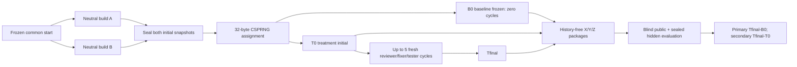

# Permissions Playground review-loop experiment

This repository is the prospective common-start scaffold for protocol version 2.2.0-frozen. It tests a treatment-only review loop after two independent builders create the same React permissions-policy playground from an identical neutral prompt and configuration.

## Status

- Phase: protocol 2.2.0-frozen preregistration lock, before builder exposure
- Product: intentionally not implemented on this branch
- Public contract tests: committed but gated until all required implementation files exist
- Hidden tests: sealed externally; the existing v2 commitment remains unchanged
- Treatment algorithm: exact skill-v1 flow incorporated and content-addressed
- Experiment lock: 2.2.0-frozen, bound to the corrected integrated skill and content parent
- License: none has been granted; no license file is included

Do not present this branch as a completed application or executable experiment. A passing scaffold check establishes internal consistency only.

## Five-minute setup

Requires Node.js 22 and npm 11.11.0.

```sh
npm ci
npm run check
npm run dev
```

`npm run dev` serves an honest placeholder page. `npm run test:public` intentionally exits nonzero until all three implementation modules exist. `npm run check` accepts only the all-files-absent scaffold state or a complete implementation, and also runs protocol semantic tests.

## Experiment flow



The winner promoted to `main` is the higher-scoring of B0 and Tfinal; an exact tie selects baseline.

- [`docs/permissions-playground-spec.md`](docs/permissions-playground-spec.md): unchanged frozen product semantics
- [`docs/public-test-contract.md`](docs/public-test-contract.md): unchanged activation and public-test contract
- [`experiment/protocol.md`](experiment/protocol.md): assignment, freshness, budgets, evidence, evaluation, and invalidation
- [`experiment/canonical-contract.json`](experiment/canonical-contract.json): machine-readable transcription of the normative public protocol
- [`experiment/golden-run/`](experiment/golden-run/): synthetic prospective execution-mode conformance record
- [`experiment/rubric.md`](experiment/rubric.md): unchanged 100-point 50/15/15/10/10 rubric
- [`experiment/prompts/neutral-builder.md`](experiment/prompts/neutral-builder.md) and [`experiment/builder-config.json`](experiment/builder-config.json): identical neutral construction inputs
- [`experiment/treatment-loop-algorithm.md`](experiment/treatment-loop-algorithm.md): exact frozen skill-v1 flow
- [`experiment/schemas/`](experiment/schemas/): machine-readable artifact contracts and the authoritative finding schema
- [`experiment/templates/`](experiment/templates/): prospective, non-evidentiary artifact examples
- [`experiment/lock.json`](experiment/lock.json): final preregistration commitments

## Architecture and boundaries

The scaffold contains protocol documents, schemas, test contracts, public tests, and a Vite placeholder. Builders own the three required implementation modules, application documentation, and candidate-added tests. Public gates, pinned dependencies, and evaluator semantics remain immutable. Builders never receive the treatment skill or loop algorithm. Only the randomly assigned treatment snapshot is processed by fresh cycle roles; baseline remains byte-frozen at its initial snapshot.

Evaluators own the sealed hidden suite outside this repository. They receive three history-free packages labeled only X/Y/Z and never see lineage, assignment, role artifacts, or Git metadata. The browser product is specified to use local in-memory state only: no authentication, backend, network calls, credentials, persistence, or personal data.

## Limitations, security, and provenance

This is a two-candidate pilot, not a statistically powered benchmark. Its results are descriptive for this task and frozen provider configuration. Public tests expose examples and contracts, not hidden cases. Hidden fixtures must never be committed to a candidate or protocol branch.

The diagram above is the truthful visual for this protocol scaffold. Product screenshots are deferred because no product exists yet; a promoted implementation must later capture sanitized real UI evidence with alt text and provenance. The specification and protocol materials are original project work. Dependency provenance remains pinned in `package-lock.json`.

## Contributing and support

This private experiment is not accepting general contributions. Operators must record deviations and invalid attempts after they occur rather than pre-populating evidence or silently repairing them. Repository-owner support is the only support channel during the pilot.
