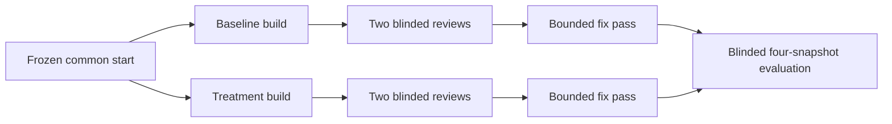

# Permissions Playground build-review-loop experiment

This repository is a frozen Phase 1 scaffold for a controlled baseline-versus-treatment software-building experiment. The target product is a React permissions-policy playground, but the product implementation is intentionally absent on this branch.

## Status

- Phase: common-start scaffold, before arm assignment
- Product: not implemented
- Public contract tests: committed but gated until the required implementation files exist
- Hidden tests: not present in this repository
- Experiment lock: provisional until the common-start commit and hidden-suite/frozen-skill hashes are supplied
- License: none has been granted; no license file is included

Do not present this branch as a completed application. A successful scaffold check establishes only that the protocol, contracts, templates, and toolchain are internally consistent.

## Five-minute setup

Requires Node.js 22 and npm 10 or newer.

```sh
npm ci
npm run check
npm run dev
```

`npm run dev` serves an honest placeholder page. `npm run test:public` intentionally exits nonzero until all required implementation modules exist. `npm run check` uses the scaffold-aware public-test runner: it permits the known all-files-absent state, then automatically runs and enforces the public suite after implementation appears.

## Experiment map



- [`docs/permissions-playground-spec.md`](docs/permissions-playground-spec.md): frozen product and evaluator semantics
- [`docs/public-test-contract.md`](docs/public-test-contract.md): required module and UI contract
- [`experiment/protocol.md`](experiment/protocol.md): assignment, blinding, measurements, invalidation, and stopping rules
- [`experiment/rubric.md`](experiment/rubric.md): 100-point blinded scoring rubric
- [`experiment/prompts/`](experiment/prompts/): exact role prompts
- [`experiment/schemas/`](experiment/schemas/): machine-readable artifact contracts
- [`experiment/templates/`](experiment/templates/): valid starting artifacts
- [`experiment/lock.json`](experiment/lock.json): freeze metadata and pending hashes

## Architecture and boundaries

Phase 1 contains only protocol documents, schemas, test contracts, public tests, and a Vite placeholder. The builders own the three required implementation modules. Evaluators own the hidden suite outside this repository. The browser application is specified to use local in-memory state only: no authentication, backend, network calls, credentials, or personal data.

Public tests expose examples and contracts, not the implementation algorithm. Hidden cases and hidden fixtures must never be committed to an arm branch. The diagram above is the truthful visual for this protocol scaffold. Product screenshots are intentionally deferred because there is no implemented product to document yet; each completed arm must capture a sanitized real UI screenshot with alt text and provenance before it can claim product readiness.

## Limitations and provenance

This is a two-arm pilot with one implementation per arm, not a statistically powered benchmark. Its primary result is descriptive. The specification and experiment files are original project materials prepared for this experiment. Dependency provenance is recorded by `package-lock.json` after `npm install`.

## Contributing and support

This private experiment is not accepting general contributions. Experiment operators should follow the frozen protocol and record deviations rather than silently repairing them. Repository-owner support is the only support channel during the pilot.
