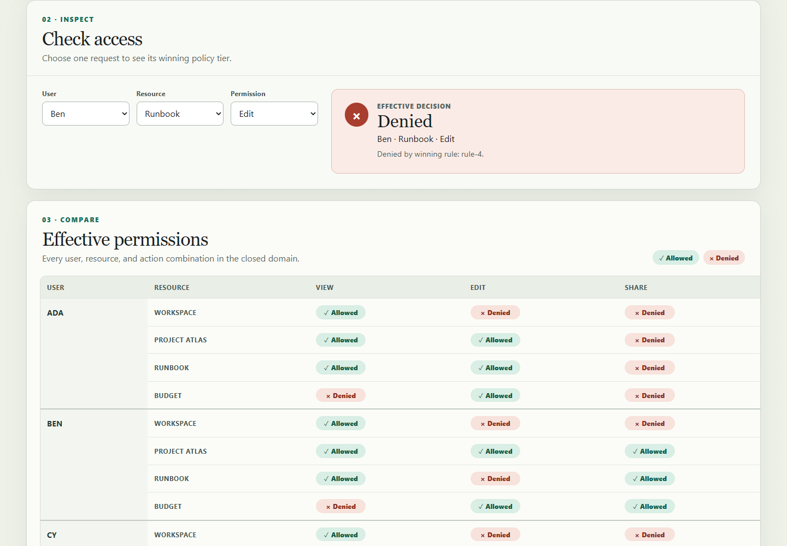
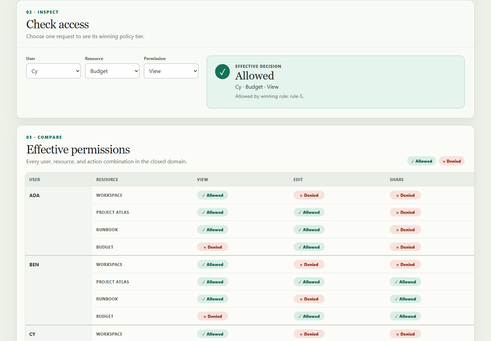

# Permissions Playground

Permissions Playground is a small, client-only React application for learning how resource scope, subject specificity, and explicit denies combine in an access-control policy. It is an educational simulator for developers and product teams—not an authorization system.

The implementation is complete for the frozen experiment specification. Users can enable, disable, delete, reset, and add constrained rules; inspect one request; and compare all 36 effective user/resource/action decisions.

## See it in action



_Explicit deny: the exact Ben / Runbook / Edit rule wins. Captured from the production build at 1440 × 1000 CSS pixels on 2026-07-20._



_Specific allow: Cy's user rule beats the everyone deny at the same resource. Captured from the production build at 1440 × 1000 CSS pixels on 2026-07-20._

Detailed capture provenance and alt text are in [`docs/screenshots/README.md`](docs/screenshots/README.md).

## Five-minute setup

Requires Node.js 22 and npm 10 or newer.

```sh
npm ci
npm run check
npm run dev
```

Open the local URL printed by Vite. No account, server, environment variable, or credential is needed.

Useful commands:

```sh
npm run test:public        # frozen public contract: 14 tests
npx vitest run             # public + builder-added suite: 22 tests
npm run build              # typecheck and production bundle
npm run check              # formatting, lint, types, scaffold, public tests, build
```

## How policy resolution works

For a selected user, resource, and action, the evaluator:

1. keeps enabled rules with matching actions, subjects, and resource scope;
2. keeps rules on the closest matching resource;
3. keeps the most-specific subject tier (user, then group, then everyone); and
4. denies if any rule in that final tied tier denies.

No match defaults to denied. Rule order has no effect, and all tied winner IDs are reported in sorted order.

## Architecture

- [`src/permissions/model.ts`](src/permissions/model.ts) contains the closed domain and exact seven-rule fixture.
- [`src/permissions/evaluate.ts`](src/permissions/evaluate.ts) contains the pure, deterministic evaluator. Runtime-invalid policies and duplicate rule IDs fail closed.
- [`src/PermissionsPlayground.tsx`](src/PermissionsPlayground.tsx) owns in-memory policy/form/query state and derives the checker and matrix from the same evaluator.
- [`src/scaffold.css`](src/scaffold.css) provides the responsive visual system. At 320 CSS pixels, wide semantic tables scroll inside their panels without moving the page itself.
- [`tests/builder/`](tests/builder/) adds regression coverage for precedence, tied denies, invalid policies, deterministic IDs, constrained subjects, derived UI updates, and live-region semantics.

There is one browser route and no asynchronous application state. The production output in `dist/` is generated and intentionally not committed.

## Security and privacy boundaries

All policy state stays in React memory and returns to the initial fixture on reload. The application makes no network requests, persists no data, accepts no free text or HTML, and has no `eval`/`Function`, authentication, backend, secrets, analytics, or third-party service integration. Inputs are limited to the fixed domain through native select controls.

The evaluator is designed to explain this frozen toy model. It has not been designed, audited, or deployed as a production authorization enforcement point.

## Accessibility

The page uses one `h1`, labeled regions and controls, a live decision status, semantic tables, explicit Allowed/Denied text, native keyboard controls, visible focus styles, and non-color status symbols. The matrix exposes one accessible result name for every user/resource/action combination.

## Limitations

- The users, groups, resources, actions, and hierarchy are fixed and cannot be edited.
- State is session-local and is not imported, exported, persisted, or shared.
- Actions are independent; Edit does not imply View.
- There is no authentication, authorization enforcement, backend, database, undo/redo, drag ordering, or deployment configuration.
- The experiment is a two-arm pilot with one implementation per arm, so its eventual comparison is descriptive rather than statistically generalizable.

## Specification and provenance

Product behavior is governed by the frozen [`docs/permissions-playground-spec.md`](docs/permissions-playground-spec.md) and [`docs/public-test-contract.md`](docs/public-test-contract.md). The source and documentation are original experiment materials. Dependency identities and integrity hashes are recorded in `package-lock.json`; the implementation does not add or upgrade dependencies.

Screenshot source revision: `PENDING_BUILD_SNAPSHOT` (finalized in the candidate run artifact after the implementation commit).

## License and support

No license has been granted and no license file is included. The repository is private; do not assume permission to use, copy, modify, or redistribute its contents. This experiment is not accepting general contributions. Repository-owner support is the only support channel during the pilot.
