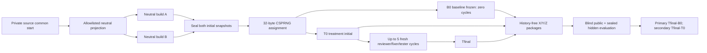

# Permissions Playground review-loop experiment

This repository is the prospective source scaffold for protocol version 2.5.0. Before builder launch, a deterministic allowlist projects only neutral Permissions Playground task files into two byte-identical, freshly initialized one-root Git repositories. Builders never receive this repository, its history, README, experiment material, skills, hidden material, or evidence.

## Status

- Phase: protocol 2.5.0 preregistration correction, before builder exposure
- Product: intentionally not implemented on this branch
- Public contract tests: committed but gated until all required implementation files exist
- Hidden tests: sealed externally; the existing v2 commitment remains unchanged
- Treatment algorithm: exact skill-v1 flow incorporated and content-addressed
- Experiment lock: 2.5.0 successor to the aborted-before-launch 2.4.0 lock
- License: none has been granted; no license file is included

Do not present this branch as a completed application or executable experiment. A passing scaffold check establishes internal consistency only.

## Five-minute setup

Requires Node.js 22 and npm 11.11.0.

```sh
npm ci
npm run check
npm run dev
```

`npm run dev` serves an honest placeholder page. `npm run test:public` intentionally exits nonzero until all three implementation modules exist. `npm run check` accepts only the all-files-absent scaffold state or a complete implementation, and also runs protocol semantic tests.

## Experiment flow



The winner promoted to `main` is the higher-scoring of B0 and Tfinal; an exact tie selects baseline.

- [`docs/permissions-playground-spec.md`](docs/permissions-playground-spec.md): unchanged frozen product semantics
- [`docs/public-test-contract.md`](docs/public-test-contract.md): unchanged activation and public-test contract
- [`experiment/protocol.md`](experiment/protocol.md): assignment, freshness, budgets, evidence, evaluation, and invalidation
- [`experiment/canonical-contract.json`](experiment/canonical-contract.json): machine-readable transcription of the normative public protocol
- [`experiment/golden-run/`](experiment/golden-run/): synthetic prospective execution-mode conformance record
- [`experiment/rubric.md`](experiment/rubric.md): unchanged 100-point 50/15/15/10/10 rubric
- [`experiment/prompts/neutral-builder.md`](experiment/prompts/neutral-builder.md) and [`experiment/builder-config.json`](experiment/builder-config.json): identical neutral construction inputs
- [`experiment/builder-input-allowlist.json`](experiment/builder-input-allowlist.json), [`experiment/schemas/builder-input-manifest.schema.json`](experiment/schemas/builder-input-manifest.schema.json), and [`scripts/prepare-builder-input.mjs`](scripts/prepare-builder-input.mjs): hash-bound source-to-product projection policy, private manifest contract, and deterministic two-repository preparer
- [`experiment/treatment-loop-algorithm.md`](experiment/treatment-loop-algorithm.md): exact frozen skill-v1 flow
- [`experiment/schemas/`](experiment/schemas/): machine-readable artifact contracts and the authoritative finding schema
- [`experiment/templates/`](experiment/templates/): prospective, non-evidentiary artifact examples
- [`experiment/lock.json`](experiment/lock.json): protocol 2.5 commitments and sanitized preflight binding
- [`experiment/preflight/aborted-lock-2.4.0.json`](experiment/preflight/aborted-lock-2.4.0.json): sanitized record of the prelaunch candidate/tester gate mismatch; no builder, model, seed, assignment, treatment, or evaluation occurred
- [`experiment/preflight/`](experiment/preflight/): P-bound 41-file S↔P parity inventory and sanitized A/B/C evidence commitments

The three gates were executed against parent commit `f957cdf3054b8055a3d4b90d7cae0fbb8c79394c` (P), not against either administrative finalization. This successor seal supersedes F (`a37774cf25821103861ed94c261ac5db4f433860`) only to bind S2's portable canonical-Git-byte manifest: 52 entries verified by its committed manifest tool, independent of worktree line-ending smudging. P and every A/B/C commitment remain unchanged. No candidate received task material and no model run was performed at F or its successor. The unchanged copied 41-file inventory proves S2's protocol-derived sources still match P; the finalizations intentionally differ only in enumerated administrative sealing files. The legacy `runnerSmoke*` fields remain null because gate B is a reviewer exact-commit closure, not an exact instance of the older runner-smoke contract.

## Architecture and boundaries

The scaffold contains protocol documents, schemas, test contracts, public tests, parameterized supervisors, a deterministic builder-input projector, a deterministic blinding packager, and a Vite placeholder. First prepare two neutral repositories with `node scripts/prepare-builder-input.mjs` and the exact bound source commit/tree, allowlist, destinations, and private manifest arguments. The preparer rejects symlink, junction, or reparse-point ancestors and uses native realpath canonicalization through each prospective path's nearest existing physical parent before enforcing nonnesting. Then invoke neutral construction as `pwsh -NoProfile -File scripts/run-cli-builders.ps1 -ContractPath <absolute-contract.json>`. Before creating evidence or runtime directories or launching a model, the builder runner validates the private manifest and projection-policy hashes; uses the frozen `scripts/canonicalize-paths.mjs` helper to collapse existing and prospective short-name or other physical aliases; proves both workdirs, every authoritative output, all external temp/cache/dependency roots across invocations, and every private input satisfy the canonical distinctness and nonnesting graph; and requires the complete visible filesystem outside root `.git` to equal the manifest's exact file, directory, byte, and hash set. It also checks the aggregate projection hash, identical one-root commit/tree, disabled remotes, and `core.autocrlf=false`. After each model exits, it preserves a deterministic full visible-filesystem snapshot and hash outside the workdir and requires the evidence root to contain exactly the authoritative outputs and necessary parent directories with no reparse points; legitimate ignored build output is recorded rather than treated as a dirty tracked-file failure. Invoke one reviewer, fixer, tester, or evaluator as `pwsh -NoProfile -File scripts/run-cli-role.ps1 -ContractPath <absolute-role-contract.json>`. Both runners hash-bind and use the same canonical-path helper for every private/workdir/evidence/output/runtime comparison, require the frozen PowerShell 7 host, schema-validate the complete runtime contract before any Codex launch, use frozen `gpt-5.4`/`xhigh` argv, raw stdin, fresh external processes, and content-addressed evidence. Before any role evidence or runtime directory is created, the role runner requires evidence and workdir separation, exactly four pairwise-nonnested direct-child outputs, external pairwise-nonnested temp/cache/dependency roots, and every private input separate from every mutable root and output. It then strict-parses the prompt's UTC deadline, starts the monotonic budget clock before capturing the wall-clock supervisor start, and requires the absolute deadline to be later than that start but no later than `deadlineSeconds` after it. The runner floors the wall-clock absolute budget, subtracts every millisecond of monotonic elapsed time—including directory, process-start, stdin, and other scheduling delay before the wait—and treats a remaining interval below one millisecond as zero. `completedAt` is the actual OS exit time and must not exceed the deadline; only the distinct `completionObservedAt` and process-tree termination receive a two-second tolerance. The supervisor overwrites review/fix/test artifact chronology with its observed start and actual exit and evaluator chronology with its actual exit/seal, then binds the enclosing interval and observation time in supervision evidence. `smokeMode: true` is reserved for the exact committed harmless runner-smoke prompt; normal construction accepts only the neutral builder prompt. Although this CLI exposes `--output-schema`, role argv omits it until a distinct pre-injection schema is frozen: the authoritative final schema requires observed runtime identity and chronology, which the supervisor—not the model—must inject.

Create evaluator inputs with `node scripts/package-blinded-snapshots.mjs --mapping <private-mapping.json> --output-root <fresh-output-directory> --manifest <private-manifest.json>`. Prepare each clean independent source clone with `git -c core.autocrlf=false clone ...` and retain `core.autocrlf=false`; this keeps frozen gate bytes stable before history-free export. The packager exports only regular blobs enumerated by the bound `HEAD` tree, reading each blob from Git rather than recursively copying the working filesystem. Ignored or untracked private files therefore cannot enter a package. The mapping supplies the exact X/Y/Z order, B0/T0/Tfinal source clones, source refs, commit/tree bindings, frozen public-gate-set hash, and exact private provenance markers (candidate/run IDs, evidence paths, and role-artifact names). Generic product or dependency vocabulary is allowed; exact private markers and Git/protocol/evidence artifacts are rejected. The manifest must remain outside the output root.

Evaluators own the sealed hidden suite outside this repository. Each fresh evaluator receives exactly one history-free package labeled only X, Y, or Z and never sees lineage, assignment, another package, role artifacts, or Git metadata. It seals one score and post-score mapping diagnostic before the next evaluator starts. The browser product is specified to use local in-memory state only: no authentication, backend, network calls, credentials, persistence, or personal data.

## Limitations, security, and provenance

This is a two-candidate pilot, not a statistically powered benchmark. Its results are descriptive for this task and frozen provider configuration. Isolation is an audited procedural boundary plus the CLI sandbox, not kernel-enforced proof against every child-process, network, junction, or reparse-point escape. Operators must use non-reparse, nonnested roots and audit pre/post Git and evidence commitments. Public tests expose examples and contracts, not hidden cases. Hidden fixtures must never be committed to a candidate or protocol branch.

The diagram above is the truthful visual for this protocol scaffold. Product screenshots are deferred because no product exists yet; a promoted implementation must later capture sanitized real UI evidence with alt text and provenance. The specification and protocol materials are original project work. Dependency provenance remains pinned in `package-lock.json`.

## Contributing and support

This private experiment is not accepting general contributions. Operators must record deviations and invalid attempts after they occur rather than pre-populating evidence or silently repairing them. Repository-owner support is the only support channel during the pilot.
