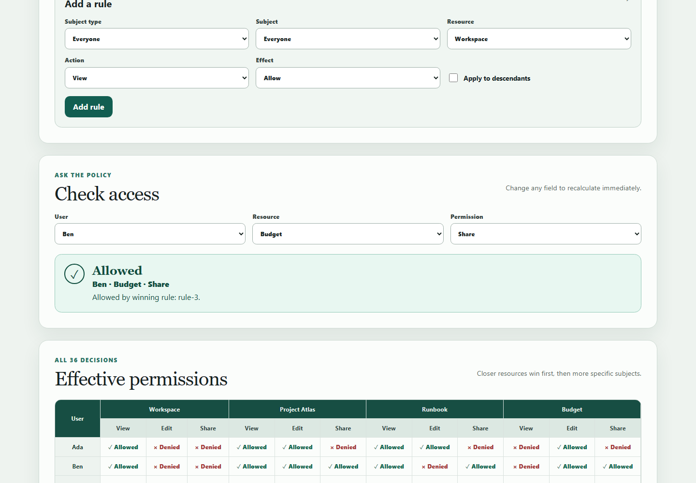
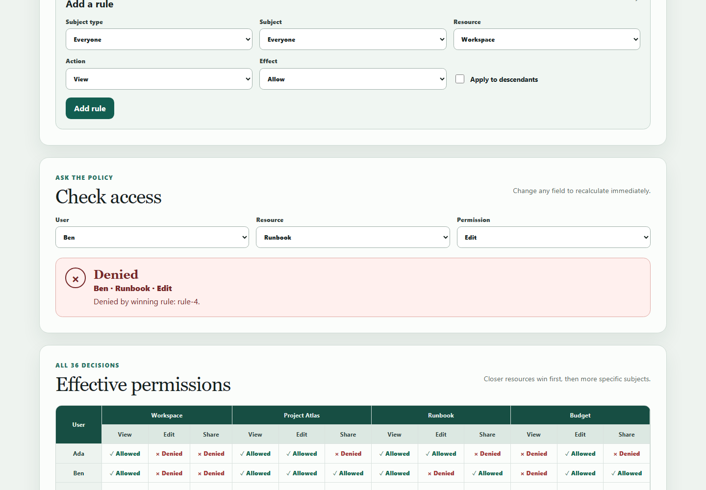

# Permissions Playground

Permissions Playground is a small, client-only React application for exploring a fixed access-control policy. It shows why a user is allowed or denied, lets you safely edit the in-memory fixture, and recalculates all 36 user/resource/action combinations immediately.

It is an educational policy sandbox, **not** a production authorization system.

## Status

This candidate build implements the frozen `1.0.0-frozen` product specification. The closed domain contains three users, two groups, four resources, three independent actions, and seven initial rules. There is no release or deployed service associated with this experiment snapshot.

## Five-minute setup

Requirements: Node.js 22 and npm 10 or newer (the frozen run uses npm 11.11.0).

```sh
npm ci
npm run check
npm run dev
```

Open the local URL printed by Vite. To exercise the initial explicit-deny case, leave the checker at **Ben / Runbook / Edit**. To see an allow, choose **Ben / Budget / Share**. Try disabling `rule-5` to see Cy / Budget / View fall through to the explicit deny in `rule-6`, then use **Reset policy** to restore the fixture.

Useful focused commands:

```sh
npm run test:public
npm run test:additional
npm run build
npm run preview
```

## Product evidence

Both images are real, sanitized captures from the locally served production build at a fixed 1440 × 1000 CSS-pixel viewport. They contain only the repository's fictional closed-domain fixture and no accounts, secrets, personal paths, or external data.



_Allow state — Ben / Budget / Share is Allowed by `rule-3`. Captured 2026-07-20 from this candidate's `npm run build` output served locally with `npm run preview`; source snapshot binding is recorded in `experiment/runs/candidate-a/run-manifest.json`. Original project UI; no third-party visual assets._



_Explicit-deny state — Ben / Runbook / Edit is Denied by `rule-4`. Captured 2026-07-20 from the same local production build and fixed viewport; source snapshot binding is recorded in the candidate run manifest. Original project UI; no third-party visual assets._

The PNGs are static fallbacks suitable for GitHub and offline review. Run the app for the keyboard-operable, responsive experience.

## How decisions work

The evaluator is deterministic and default-deny:

1. Ignore disabled rules and actions that do not match.
2. Match Everyone, fixed group memberships, or the exact user, plus the exact resource or opted-in descendants.
3. Keep the closest matching resource tier.
4. Within that tier, keep the most specific subject tier (user, then group, then Everyone).
5. If any tied winner is Deny, deny; otherwise allow. With no matches, deny.

All winning rule IDs are sorted before they are explained. Runtime validation fails closed for malformed queries, invalid rule fields, inconsistent subjects, and duplicate IDs.

## Architecture

```text
src/permissions/model.ts       closed domain, types, initial fixture
             │
             ▼
src/permissions/evaluate.ts    pure validation + decision function
             │
             ▼
src/PermissionsPlayground.tsx  local editor state + checker + 36-cell matrix
             │
             ▼
src/main.tsx                   React/Vite browser entry point
```

React owns only in-memory UI state. The checker and matrix derive their results through the same pure evaluator, so there is no second policy algorithm to drift. Plain CSS supplies the visual system, visible focus, readable status cues, card layout, and horizontally scrollable matrix at narrow widths.

## Security and privacy boundaries

- No backend, authentication, accounts, network requests, analytics, or telemetry.
- No cookies, browser storage, database, or policy persistence; reload returns to the fixture.
- Rule values come only from closed native select and checkbox controls. There is no free-text policy input, HTML rendering sink, `eval`, or `Function` construction.
- The evaluator explains a toy policy but does not enforce access. Do not use it as a production authorization boundary.
- No secrets or credentials are required. Dependencies are pinned in `package-lock.json`.

## Testing

`npm run check` runs formatting, linting, strict TypeScript checks, frozen scaffold/schema validation, all 14 public assertions, 9 builder-added behavioral assertions, and a production build. Additional tests cover distance-versus-specificity, tied deny precedence, malformed-policy fail-closed behavior, immutable input, constrained subjects, monotonic/reset rule IDs, derived matrix updates, deleting the final rule, accessible status structure, and the no-network boundary.

The public tests and activation runner remain frozen. The shared test setup adds explicit Testing Library cleanup so independent render cases do not retain DOM from earlier tests.

## Limitations

- The user/group/resource domain is intentionally fixed and cannot be imported or edited.
- Actions are independent; Edit does not imply View.
- State is not persisted, synchronized, exported, or undoable.
- The matrix is intentionally dense and horizontally scrolls on small screens.
- Browser verification covers the required fixed desktop viewport and 320 CSS-pixel responsive use; it is not an exhaustive assistive-technology certification.
- This is one candidate in a two-arm descriptive pilot, not a statistically powered benchmark.

## License and provenance

No license has been granted and no `LICENSE` file is present. Default copyright restrictions apply; repository visibility or access does not imply permission to reuse the code. Product source, documentation, tests, and visuals in this candidate are original experiment materials. Third-party package names and licenses remain their respective owners' property; exact dependency versions are recorded by the unchanged lockfile.

## Contributing and support

This private experimental snapshot is not accepting general contributions. Experiment operators should follow the frozen protocol and record deviations rather than silently changing common artifacts. Repository-owner support is the only support channel for the pilot.
